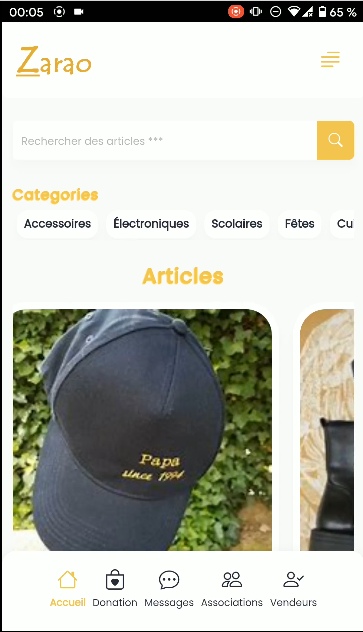

# IFM-2022
### Hackathon IFM 2022
- [ ] Technologies utilisées:
  - Vuejs (Application web)
  - [Nestjs (API)](https://api-zarao.iteam-s.mg/docs/)
  - [Angular (mobile)](https://github.com/hackathon-ifm-2021/IFM-2022/blob/main/mobile.mp4)
  - Bootstrap
  
- [ ] Lien vers le swagger de l'API:
  `https://api-zarao.iteam-s.mg/docs`

      
      

